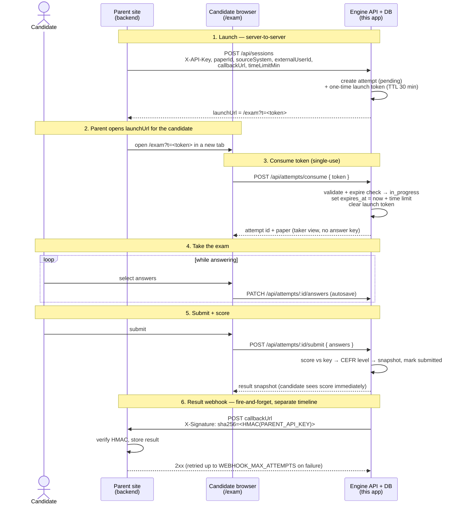

# english-test

TOEIC-style English proficiency test web app with Gofive branding. A React 18 + Vite single-page app for taking the exam, paired with an Express + Prisma (SQL Server / Azure SQL) backend that stores exam content, manages candidate attempts, scores submissions server-side (TOEIC-style + CEFR level), and can be launched from a parent site via one-time session tokens. Exam content is authored through a built-in admin UI.

> This app lives in `apps/english` of the **gofive-exams** monorepo and is normally mounted at `/english` behind the path-routing gateway (see the repo-root `README.md`). Everything below also works standalone for development.

## Repository layout

```
apps/english/
├── src/                      # React app (exam taker + admin UI)
│   ├── App.jsx               # Version-aware flow state machine + URL routing
│   ├── admin/                # Admin UI mounted at /admin (content editor + attempts history)
│   ├── components/           # ExamSection, audio bar, navigator, exam clock, tweaks panel, ...
│   ├── screens/              # Landing, AudioCheck, Instructions, Listening, EndOfListening, Reading, Results
│   ├── state/ExamContext.jsx # Exam state — localStorage (`et-*`) + server attempt autosave
│   ├── data/exam.js          # Shapes a paper bundle into EXAM (data-shape only)
│   ├── data/examRepo.js      # API client (papers, sections, items, attempts, seed)
│   ├── lib/base.js           # Base-path helpers (standalone '' vs gateway '/english')
│   └── styles/               # Plain CSS + design tokens
├── server/                   # Express API + Prisma/SQL Server (content, attempts, scoring, webhooks)
│   ├── src/                  # app.js, index.js, routes/, db, scoring, cefr, shape, webhook, openapi, middleware
│   └── prisma/               # schema.prisma + migrations (owns the english + shared schemas)
├── public/                   # Static assets: voice/, fonts/, logo
├── papers_export_1_full.json # Seed source: full paper (gitignored — answer keys)
├── papers_export_2_short.json# Seed source: 15-min short placement paper (gitignored)
├── vite.config.js            # Dev server on :5175, proxies /api → :3002
├── CLAUDE.md / AGENTS.md     # Developer guidance
└── dist/                     # Production build output
```

## Prerequisites

- **Node.js 18+** and npm
- **Docker Desktop** — for SQL Server (Azure SQL Edge); the shared container is defined in `../mbti/docker-compose.yml`

The React app loads all exam content from the API, so the backend and a seeded database are required to run the exam — there is no offline/bundled-JSON mode. The `papers_export_*.json` files are only seed sources (and are gitignored — they contain the answer keys).

## Quick start

Run these from `apps/english`. Commands are shown for both PowerShell (Windows) and bash/zsh (macOS/Linux); pick the line that matches your shell.

> **Do not use `npm --prefix <dir> install`** — npm on Windows corrupts the app's package.json/lockfile when a parent package is in scope (see the repo-root `CLAUDE.md`). `cd` into the directory instead.

```powershell
# 1. Configure the backend environment
#    server/.env → DATABASE_URL, PORT=3002, admin credentials, session/webhook settings
Copy-Item server\.env.example server\.env   # bash: cp server/.env.example server/.env

# 2. Start SQL Server (Azure SQL Edge) via the shared container
docker compose -f ..\mbti\docker-compose.yml up -d   # bash: docker compose -f ../mbti/docker-compose.yml up -d

# 3. Install dependencies (app + server) and apply the DB schema
npm install
cd server; npm install                      # bash: cd server && npm install
npm run migrate                             # prisma migrate deploy (english + shared schemas)
cd ..

# 4. Start the frontend and API together
npm run dev:all      # Vite (:5175) + API (:3002), color-tagged output
```

Then:

- Exam: `http://localhost:5175`
- Admin UI: `http://localhost:5175/admin`
- API health check: `http://localhost:3002/api/health`
- API docs (Swagger): `http://localhost:3002/api/docs`

The database starts empty. **Before the exam will load**, populate the content by clicking **Seed from JSON** in the admin UI, or by running `npm run seed` inside `server/` (pass another JSON path as an argument to seed the short paper). Until then the exam shows a "Could not load the exam" screen.

### Environment variables

The frontend needs no env file — public config (just an `uploadEnabled` flag for the admin UI) is served by the backend at `GET /api/config`, so the bundle stays config-free. Admin media (images/audio) lives in Azure Blob Storage; the server proxies both upload (`PUT /api/media`) and read (`GET /api/media/:name`) through a server-held SAS, so the storage credential never reaches the browser.

`server/.env` (backend) — key settings:

| Variable | Purpose |
| --- | --- |
| `DATABASE_URL` | SQL Server connection string (shared `gofive_assessments` DB on `localhost:1433`) |
| `PORT` | API port (`3002` for standalone dev — the code default `3001` collides with mbti) |
| `ADMIN_USERNAME` / `ADMIN_PASSWORD` | HTTP Basic credentials for the admin UI and admin-only API routes (unset = admin disabled, 503) |
| `PARENT_API_KEY` | Shared secret (`X-API-Key`) for server-to-server calls and signed result webhooks |
| `AZURE_STORAGE_ACCOUNT` / `AZURE_STORAGE_CONTAINER` / `AZURE_STORAGE_SAS` | Azure Blob Storage for admin media uploads (proxied via `PUT`/`GET /api/media`); unset = uploads disabled (503). SAS is rotatable without redeploy |
| `ENGINE_PUBLIC_URL` | Public URL of this engine, used to build candidate launch/view URLs |
| `LAUNCH_TOKEN_TTL_MIN` | How long a one-time launch token stays valid (default `30`) |
| `DEFAULT_TIME_LIMIT_MIN` | Fallback per-attempt time limit when none is specified (default `60`) |
| `VIEW_LINK_TTL_MIN` / `VIEW_LINK_SECRET` | Read-only result-link TTL + signing secret (secret derives from `PARENT_API_KEY` when unset) |
| `WEBHOOK_TIMEOUT_MS` / `WEBHOOK_MAX_ATTEMPTS` | Result-webhook delivery timeout and retry count |

See `server/.env.example` for the full list.

## Scripts

Root (`package.json`):

| Command | Description |
| --- | --- |
| `npm run dev` | Start Vite dev server (`:5175`) |
| `npm run build` | Production build to `dist/` (the gateway builds with `--base=/english/`) |
| `npm run preview` | Preview the production build (`:4175`) |
| `npm test` | Run unit tests (Vitest, Node env) |
| `npm run test:watch` | Vitest in watch mode |
| `npm run server` | Start the Express API only (proxies to `server`'s dev script) |
| `npm run dev:all` | Run Vite + API concurrently |

Server (`server/package.json`):

| Command | Description |
| --- | --- |
| `npm run dev` | Start API with nodemon (`:3002` from `server/.env`) |
| `npm start` | Start API |
| `npm run migrate` | Apply Prisma migrations (`prisma migrate deploy`) |
| `npm run migrate:dev` | Author a new migration in dev (`prisma migrate dev`) |
| `npm run generate` / `npm run studio` | Prisma client codegen / Prisma Studio |
| `npm run seed` | Seed DB from `papers_export_1_full.json` (or a JSON path passed as argument) |

## App architecture

### Exam flow and routing (`src/App.jsx`)

The flow is built per **version** by `buildFlow(version)`:

- **Full** — Landing → AudioCheck → InstructionsListening → Listening → EndOfListening → InstructionsReading → Reading → Results.
- **Short** (reading-only) — Landing → InstructionsReading → Reading → Results.

Which question set a paper is comes from its **name**: a paper named with the word "short" (or Thai "สั้น") is the short set (`paperVariant()` in `server/src/shape.js`; exposed as `variant: 'full' | 'short'` on `GET /api/papers`). Renaming a paper changes which set it is. The flow that actually runs, however, derives from the paper's **content** — a loaded paper with no listening (Part 1–4) sections skips the audio screens regardless of its label. Duration comes from the paper's `time_limit_min` (falling back to `VERSIONS` in `ExamContext.jsx`). `SHORT_ENABLED` in `ExamContext.jsx` is the kill switch that hides every short entry point.

The app is path-routed (no hash router) into three zones:

- `/exam/full` and `/exam/short` — the entry links. Each opens on the landing/overview of that version (the URL picks **which paper to ask for**, by `variant`) and is also the **single locked URL shared by every test screen**. Once a candidate starts, the address bar stops moving (so it never leaks progress), browser Back is trapped, and a `beforeunload` warning guards against leaving. Refreshing here restarts the attempt back at the overview.
- `/` — alias for the full landing (the original public URL).
- `/admin` — the admin UI.

A parent site launches a candidate at `/exam?t=<launch_token>` (see **Sessions & attempts**). The launch URL carries no version segment — the flow follows the paper the parent attached to the session, so a short paper automatically skips the audio screens.

Navigation within the flow works two ways:

1. **Tweaks panel** (dev only) — explicit "jump to any screen / part / question" buttons.
2. **Text-matched click hijacking** — a root-level handler reads `e.target.textContent` and matches against `NEXT_PATTERNS` / `PREV_PATTERNS`. Any `<button>` whose visible text contains phrases like "start the test", "next question", "begin", "submit", or "previous" advances/retreats the flow. Buttons inside screens generally do not wire up their own `onClick` for navigation.

If you add a navigation button, either reuse one of those phrases or extend the patterns in `App.jsx`.

### Exam data (`src/data/exam.js` + `examRepo.js`)

The frontend fetches the current paper from the API (`examRepo.js`); `exam.js` is data-shape only — `buildExam(bundle)` turns a `{ paper, sections }` bundle into `EXAM = { meta, parts, flat }`:

- **Parts 1–4** Listening, **5–6** Vocabulary/Grammar (reading), **7** Reading Comprehension.
- Each part is composed of **groups** (passage + items, or single-item groups for non-passage parts).
- Helpers: `partsBySection`, `totalsBySection`, `computeScores`, `computeSectionTotals`, `getOptionLetters`.

Part titles, skills, sections, passage flags, and listening audio paths live in `PART_META` / `PART_AUDIO` inside `exam.js`. The audio mp3s under `public/voice/` are referenced by `PART_AUDIO`.

### Exam state (`src/state/ExamContext.jsx`)

Local state is persisted to `localStorage` under `et-*` keys:

- `answers` — `{ [itemId]: 'A' | 'B' | ... }`
- `flagged` — `Set<itemId>` (serialized as array)
- `position` — `{ partNumber, groupIndex }`
- `mode` — `'strict'` (auto-play audio, countdowns, locked nav) or `'free'` (dev mode)
- `secondsPerItem` — strict-mode per-question countdown (dev)
- `version` — `'full' | 'short'`

A single **test-wide clock** governs real runs: `startExamTimer()` stamps `examStartedAt` when the candidate reaches the first timed screen, and `examTotalSeconds` (from `VERSIONS[version].minutes`) drives the countdown shown on every timed screen via `useExamCountdown`. When it expires, `App.jsx` jumps straight to Results.

When the candidate commits to taking the test, `commitAttempt()` creates the server-side attempt row (anonymous walk-ins) or reuses the one consumed from a launch token (parent sessions). Answers autosave to the attempt (~500 ms debounce) and `submitFinal()` posts them for server-side scoring. `enterSection('listening' | 'reading')` snaps `position` to the first part of that section; `resetExam` clears answers and flags.

### Theming

Plain CSS in `src/styles/` (`colors-and-type.css` + `styles.css`) using CSS custom properties (`--color-primary`, `--bg-app`, `--fg-*`, `--gf-*`). The dev-only `TweaksPanel` (bottom-right) lets you live-switch brand color, atmosphere (light/default/dark), and corner style (sharp/default/soft). The base `.et` class scopes the brand variables.

## Backend

Express + Prisma over SQL Server / Azure SQL. The Vite dev server proxies `/api/*` to `http://localhost:3002`. The database is the **shared** `gofive_assessments` DB (SQL Server on `localhost:1433`, container defined in `../mbti/docker-compose.yml`); this app owns the migration ledger for the `english` + `shared` schemas — see `server/README.md` for the schema-ownership rules. The Express `app` is built in `server/src/app.js` and exported (the gateway mounts it at `/english`); `server/src/index.js` is the standalone entrypoint.

### Content routes (admin UI)

- `GET /api/health`
- `papers`, `sections`, `items` — CRUD for exam content. Taker fetches omit the answer key/explanation; the admin fetch (`?withAnswers=1`) includes them. Mutations and the seed endpoint require HTTP Basic admin auth.
- `seed` — populate the DB from `papers_export_1_full.json` (also a button in the admin UI).
- `GET /api/openapi.json` and Swagger UI at `/api/docs`.

### Sessions & attempts (`server/src/routes/attempts.js`)

The exam can be embedded by a parent site, or taken anonymously from the public URL.

The parent-launched flow is a **launch-token + result-webhook** handshake. A single shared secret (`PARENT_API_KEY`) secures it both ways: as an `X-API-Key` on the inbound session call, and as the HMAC signing key on the outbound result webhook.



> The 30-min launch-token TTL only bounds the window **before** the candidate starts — it is checked once at consume, then the token is cleared. The exam timer (`expires_at`, e.g. 50 min) starts fresh at consume and is independent of the token TTL.

All parent-facing request/response fields are **camelCase** (`paperId`, `externalUserId`, `callbackUrl`, `launchUrl`, `completedAt`, …) and the terminal status on the wire is `completed` — the unified contract shared with the mbti engine (`toParentAttempt()` / `parentStatus()` in `server/src/routes/attempts.js` do the mapping; internal DB columns stay snake_case).

Endpoints:

- `POST /api/sessions` (parent-auth) — creates a `pending` attempt + a one-time launch token and returns a `launchUrl` (`/exam?t=…`) for the parent to open in the candidate's browser.
- `POST /api/attempts/consume` — the candidate's browser trades the token for the attempt + the paper (taker view); marks it `in_progress`. Single-use.
- `POST /api/attempts/anonymous` — public walk-in attempt (no token), defaults to the full paper.
- `GET /api/attempts/:id` — fetch one attempt (parent sees the camelCase shape, status `completed` when submitted).
- `PATCH /api/attempts/:id/answers` — autosave the answer map.
- `POST /api/attempts/:id/submit` — score against the answer key, snapshot result + CEFR level, mark it submitted, and fire the result webhook (idempotent).
- `POST /api/attempts/:id/abandon` — discard an in-flight anonymous attempt (e.g. on refresh inside `/exam`).
- `POST /api/attempts/:id/redeliver` (parent-auth) — re-send the result webhook.
- `POST /api/attempts/:id/view-link` (parent-auth) + `GET /api/attempts/view?view_token=…` — mint/serve a signed, short-lived read-only result link (`/result?view_token=…`).
- `GET /api/subjects/:source_system/:external_user_id/results` + `POST /api/subjects/:source_system/:external_user_id/view-link` (parent-auth) — per-person result history and a view link for the latest result.
- `GET /api/attempts` (parent-auth) — list recent attempts.
- `GET /api/admin/attempts` + `GET /api/admin/attempts/:id` (admin-auth) — the attempts history view in the admin UI.

### Scoring & webhooks

- Server-side scoring lives in `server/src/scoring.js`; CEFR banding (correct-total → level label; the short paper uses its own 3-band scale) in `server/src/cefr.js`; row/shape helpers + `paperVariant()` in `server/src/shape.js`.
- On submit, the result snapshot is POSTed to the attempt's `callbackUrl` and signed with an HMAC over `PARENT_API_KEY` (`X-Signature: sha256=<hmac>`); delivery retries are bounded by the `WEBHOOK_*` settings (`server/src/webhook.js`). The webhook envelope (incl. `engineVersion`) is unified with the mbti engine — see `empeo-integration.html` at the repo root.

## Testing

Vitest runs in a Node environment (no DOM) and picks up `src/**/*.test.{js,jsx}` and `server/**/*.test.js`. Existing unit tests cover `src/data/exam.js`, `server/src/scoring.js`, `server/src/shape.js`, and `server/src/cefr.js`.

```bash
npm test
```

For UI changes, manually verify the full flow: landing → audio check → listening → end of listening → reading → results.

## Important repo notes

- `english-test-remix/` (if present) is a Claude Design handoff bundle and is gitignored — treat as a read-only design reference.
- `papers_export_1_full.json` (full paper) and `papers_export_2_short.json` (15-min short placement paper) are the seed sources loaded by the `seed` route / `npm run seed`. Both are **gitignored** (they contain answer keys); seeding happens out-of-band from a machine that has them.
- `public/voice/*.mp3` filenames are referenced by `PART_AUDIO` in `src/data/exam.js`. Rename in lockstep.
- Custom Gofive fonts live in `public/fonts/` and are declared in `src/styles/colors-and-type.css`.

## Commit conventions

Use concise Conventional Commit-style messages: `feat: ...`, `fix: ...`, `chore: ...`, `docs: ...`. Note any changes to `papers_export_1_full.json` or media filenames in the PR description because they affect rendering.
