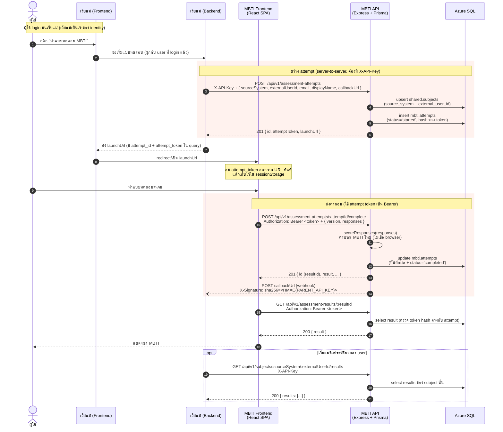

# MBTI Workplace Simulator

แอป MBTI สำหรับใช้งานในที่ทำงาน — ผู้ใช้ทำแบบทดสอบสถานการณ์ภาษาไทย แล้วได้รับผล 1 ใน 16 ประเภท MBTI พร้อมคำอธิบายแนวทางการทำงาน การสื่อสาร และจุดที่ควรพัฒนา

โปรเจกต์นี้ประกอบด้วย **frontend (React + Vite)**, **backend API (Express)** และ **Azure SQL / SQL Server** (เข้าถึงผ่าน **Prisma ORM**) สำหรับเก็บผลการทำแบบทดสอบ

> แอปนี้อยู่ที่ `apps/mbti` ใน monorepo **gofive-exams** และตอน deploy จะถูก mount ที่ `/mbti` หลัง gateway (ดู `README.md` ที่ root ของ repo) — ใช้ **ฐานข้อมูลร่วม `gofive_assessments`** กับ english engine โดย mbti เป็นเจ้าของเฉพาะ schema `mbti` ผ่าน SQL scripts (ห้ามรัน `prisma migrate` กับฐานร่วม) ทุกอย่างด้านล่างยังรันแบบ standalone สำหรับ dev ได้ตามเดิม

---

## Tech Stack

- **Frontend:** React 18, Vite 5 (in-memory screen routing, ไม่ใช้ router library)
- **Backend:** Node.js + Express 5
- **Database:** Azure SQL / SQL Server (local: Azure SQL Edge via Docker)
- **ORM:** Prisma 6 (schema เดียวที่ `prisma/schema.prisma`, สลับ provider ได้)
- **Styling:** Plain CSS + Gofive design tokens (`src/styles/colors_and_type.css`), IBM Plex Sans Thai

---

## Prerequisites

ติดตั้งเครื่องมือเหล่านี้ก่อนเริ่ม setup:

- **Node.js** ≥ 18 (แนะนำ LTS) — [nodejs.org](https://nodejs.org/)
- **npm** ≥ 9 (มาพร้อมกับ Node.js)
- **Docker Desktop** — สำหรับรัน SQL Server (Azure SQL Edge)
- **Git** — สำหรับ clone repo

ตรวจสอบเวอร์ชัน:

```powershell
node --version
npm --version
docker --version
```

---

## Setup (รัน Project ครั้งแรก)

### 1. Clone repo และเข้าโฟลเดอร์

```powershell
git clone <repo-url> gofive-exams
cd gofive-exams\apps\mbti
```

### 2. ติดตั้ง dependencies

```powershell
npm install
```

### 3. ตั้งค่า environment variables

คัดลอก `.env.example` เป็น `.env`:

```powershell
Copy-Item .env.example .env
```

ตัวอย่างค่าใน `.env` (ค่า default ใช้งานได้กับ docker-compose ที่ให้มา — จำเป็นจริง ๆ มีแค่ `DATABASE_URL` ที่ชี้ฐานร่วม `gofive_assessments`):

```env
DATABASE_URL=sqlserver://localhost:1433;database=gofive_assessments;user=sa;password=Your_password123;encrypt=true;trustServerCertificate=true
# ค่าอื่นมี dev default ใน server/config.js — override ได้ตามต้องการ:
# PORT=3001
# FRONTEND_URL=http://localhost:5174
# PARENT_API_KEY=dev-parent-key
# ATTEMPT_TTL_MINUTES=120
# VIEW_LINK_TTL_MIN=15 / VIEW_LINK_SECRET= / WEBHOOK_TIMEOUT_MS=8000 / WEBHOOK_MAX_ATTEMPTS=5
```

> **หมายเหตุ:** ทั้ง Prisma CLI และตัว Express server อ่าน `.env` — npm scripts รัน server ด้วย `node --env-file-if-exists=.env` (ค่า fallback สำหรับ dev ฝังไว้ใน `server/config.js`)
>
> สำหรับ **Azure SQL จริง** ให้เปลี่ยน `DATABASE_URL` เป็น connection string ของ instance นั้น เช่น
> `sqlserver://<server>.database.windows.net:1433;database=<db>;user=<user>;password=<pass>;encrypt=true;trustServerCertificate=false`

### 4. เริ่ม SQL Server (Azure SQL Edge) ด้วย Docker

```powershell
docker compose up -d
```

จะได้:
- **SQL Server (Azure SQL Edge)** ที่ `localhost:1433` (user: `sa`, password: `Your_password123`)

ตรวจสอบว่า container รันอยู่:

```powershell
docker compose ps
```

> ถ้าต้องการ GUI จัดการ DB ใช้ **Azure Data Studio** หรือ `npm run db:studio` (Prisma Studio) ได้

### 5. สร้าง schema + Prisma Client

ฐานข้อมูล `gofive_assessments` เป็น**ฐานร่วม** — แบ่งความเป็นเจ้าของ schema ชัดเจน:

- schema `english` + `shared` (รวมตาราง `shared.subjects`) — english เป็นเจ้าของ migration ledger: รัน `npm run migrate` จาก `../english/server` (ดู `../english/server/README.md`)
- schema `mbti` — apply ด้วย **SQL scripts** ใน `prisma/` ตามลำดับ: `mbti-tables.sql` → `phase2-transfer.sql` → `merge-results.sql` → `add-webhook-delivery.sql` (รันผ่าน Azure Data Studio / `sqlcmd`)

> **ห้ามรัน `npm run db:migrate` / `db:migrate:dev` กับฐานร่วม** — `prisma/schema.prisma` ของ mbti เป็นแบบ introspection ไม่ใช่ source of truth ของ DDL (scripts ใน package.json คงไว้สำหรับงาน schema เฉพาะทางเท่านั้น)

จากนั้น generate Prisma Client:

```powershell
npm run db:generate
```

ตารางที่ mbti ใช้: `shared.subjects` (mapping ตัวตนจากระบบแม่) และ `mbti.attempts` (attempt + ผลที่คำนวณแล้ว — ตาราง results เดิมถูก merge เข้ามาแล้ว)

### 6. รัน API server (terminal 1)

```powershell
npm run server
```

- API: [http://localhost:3001](http://localhost:3001)
- Swagger UI: [http://localhost:3001/api/docs](http://localhost:3001/api/docs)

### 7. รัน frontend (terminal 2)

```powershell
npm run dev
```

เปิดที่ [http://localhost:5174](http://localhost:5174) — Vite proxy `/api` ไปยัง backend ให้อัตโนมัติ

### 8. ตรวจสอบ end-to-end (optional)

```powershell
npm run api:smoke
```

---

## Troubleshooting

- **Port ชนกัน (1433, 3001, 5174):** แก้ไขใน `docker-compose.yml` / `vite.config.js` / `.env`
- **Connection refused ตอนรัน migration/scripts:** รอ SQL Server container start ให้เสร็จก่อน (`docker compose logs sqlserver`) — Azure SQL Edge ใช้เวลา warm up สักครู่
- **Login failed / password ไม่ผ่าน:** SQL Server บังคับ password ซับซ้อน (ตัวใหญ่+เล็ก+ตัวเลข ≥ 8 ตัว) — ถ้าเปลี่ยน `MSSQL_SA_PASSWORD` ต้องแก้ `DATABASE_URL` ให้ตรงกัน
- **Frontend เรียก API ไม่ได้:** ตรวจสอบว่า server รันอยู่ที่ port 3001 และ Vite proxy ใน `vite.config.js` ยังถูกต้อง
- **รีเซ็ตฐานข้อมูล:** `docker compose down -v` แล้ว `docker compose up -d` ใหม่ จากนั้น apply schema ใหม่ตามขั้นตอนข้อ 5 (english migrations + mbti SQL scripts)

---

## npm Scripts

| Script | คำอธิบาย |
| --- | --- |
| `npm run dev` | รัน Vite dev server (port 5174) |
| `npm run server` | รัน Express API พร้อม watch mode (port 3001) |
| `npm run server:start` | รัน API แบบ production |
| `npm run db:generate` | generate Prisma Client จาก `prisma/schema.prisma` |
| `npm run db:migrate` / `db:migrate:dev` | ⚠️ **ห้ามใช้กับฐานร่วม** — schema `mbti` apply ผ่าน SQL scripts ใน `prisma/` |
| `npm run db:studio` | เปิด Prisma Studio (GUI ดู/แก้ข้อมูล) |
| `npm run api:smoke` | ทดสอบ end-to-end ผ่าน API |
| `npm run build` | build frontend ไปยัง `dist/` (gateway build ด้วย `--base=/mbti/`) |
| `npm run preview` | preview built output |

ไม่มี test suite, linter, หรือ type-checker — รัน `npm run build` ก่อน handoff เพื่อจับ syntax errors

---

## Project Structure

```
apps/mbti/
├── src/                      # Frontend React app
│   ├── App.jsx               # Global state + in-memory screen routing + DevPanel
│   ├── components.jsx        # Shared UI (Mascot, Icon, Loading, ProgressDots, ...)
│   ├── data.js               # SCENARIOS (19 ข้อ — ถามจริง 18 ข้อ/รอบ) + TYPES (16 ประเภท MBTI)
│   ├── main.jsx              # React entry
│   ├── screens/
│   │   ├── Landing.jsx       # หน้าแรก + หน้าวัตถุประสงค์
│   │   ├── Quiz.jsx          # Quiz engine (mcq / chat / slider)
│   │   └── Result.jsx        # หน้าผลลัพธ์
│   ├── lib/
│   │   ├── quizPath.js       # คำนวณลำดับคำถาม + การ branching ที่ Q8
│   │   ├── scoring.js        # คะแนน MBTI 4 แกน + facets + confidence
│   │   ├── donutMath.js      # คณิตศาสตร์ slider แบบโดนัท (รวมเป็น 100)
│   │   ├── resultCatalog.js  # รายชื่อ 16 รหัส MBTI
│   │   ├── resultContract.js # schema ของผล + การ build payload
│   │   ├── resultExport.js   # ส่งผลผ่าน transport (mock/service)
│   │   ├── assessmentApi.js  # client → backend API
│   │   ├── mockParentApi.js  # mock parent website (dev only)
│   │   └── base.js           # base-path helpers (standalone '' / gateway '/mbti')
│   └── styles/
│       ├── app.css           # layout + screen styles
│       ├── colors_and_type.css  # Gofive design tokens
│       └── fonts/            # Gofive custom font files
├── server/                   # Express backend
│   ├── app.js                # Express app (routes + middleware) — export ให้ gateway mount
│   ├── index.js              # standalone entrypoint (listen :3001 + graceful shutdown)
│   ├── assessmentService.js  # business logic (create attempt, complete, ...)
│   ├── db.js                 # Prisma Client (shared instance)
│   ├── config.js             # env config (resolve ครั้งเดียวตอน boot)
│   ├── security.js           # token hash + safe compare + view-link signing
│   ├── webhook.js            # ส่งผลไป callbackUrl ของระบบแม่ (HMAC X-Signature)
│   ├── logger.js             # structured logging
│   ├── httpError.js          # error helper
│   └── smokeTest.js          # end-to-end smoke test
├── prisma/
│   ├── schema.prisma         # data model (provider=sqlserver) — introspection-style, ไม่ใช่ DDL source of truth
│   └── *.sql                 # SQL scripts สำหรับ schema `mbti` (รันตามลำดับ — ดู Setup ข้อ 5)
├── public/mascots/           # mascot PNGs (อ้างอิงผ่าน withBase('/mascots/*.png'))
├── docs/
│   ├── integration-contract.md  # API contract กับ parent website
│   └── openapi.yaml          # OpenAPI spec (เสิร์ฟที่ /api/docs)
├── docker-compose.yml        # SQL Server (Azure SQL Edge) service — ใช้ร่วมกับ english
├── vite.config.js            # dev port 5174 + /api proxy
├── CLAUDE.md                 # คำแนะนำสำหรับ Claude Code
└── AGENTS.md                 # repository guidelines
```

---

## Architecture Overview

### Screen Flow (in-memory routing)

```
landing → purpose → quiz → loading-result → result
```

`src/App.jsx` ถือ state ทั้งหมด (`screen`, `answers`, `resultRecord`, `activeAttempt`) — แต่ละ screen เปลี่ยนผ่าน callback (`onComplete`, `onBack`) ที่ mutate `screen`

### Quiz Engine

`buildPath(answers)` ใน `src/lib/quizPath.js` เดินตาม linear order คงที่ และเมื่อถึง `q9-stress` จะสลับเป็น branch question ที่ Q8 เลือกไว้ (เก็บไว้ใน field `next`)

มี 3 รูปแบบคำถาม:
- **mcq** — single-select; answer = `{ optionId, w, next? }`
- **chat** — chat bubbles เผยทีละ message ตามเวลา; answer = `{ optionId, w }`
- **slider** — donut slider แบ่ง 100 คะแนนระหว่างหลาย action; commit เมื่อรวมเป็น 100 พอดี

### Scoring

`scoreAnswers(answers)` ใน `src/lib/scoring.js` คำนวณคะแนน 4 แกน (E/I, S/N, T/F, J/P):
- ผลรวม signed sums ของ weight (`w`) จากทุกคำตอบ
- slider ใช้สัดส่วน `(distribution[id] / 100) * 2 * w` (×2 เพื่อให้น้ำหนักเทียบเท่า mcq)
- เก็บ **facets** 16 ค่า (initiating, deepFocus, empathetic, ...) แยกต่างหาก
- กำหนด **confidence**: `midzone` (<55%), `slight` (55–65%), `clear` (65–80%), `veryClear` (80%+)

### Persistence (2 ตาราง บนฐานร่วม `gofive_assessments`)

- `shared.subjects` — map parent identity → internal subject (source_system + external_user_id) — ใช้ร่วมกับ english engine (migration ledger เป็นของ english)
- `mbti.attempts` — แต่ละครั้งของการทำแบบทดสอบ + hash ของ opaque token + **ผล MBTI ที่ backend คำนวณซ้ำ** (ตาราง results เดิมถูก merge เข้ามาด้วย `merge-results.sql`; คอลัมน์ webhook delivery เพิ่มโดย `add-webhook-delivery.sql`)

---

## ภาพรวมการเชื่อมต่อกับเว็บแม่ (Parent Website Integration)

เว็บแม่ (parent website) เป็นเจ้าของ **login + master user profile** ส่วน MBTI service เป็นเจ้าของ **attempt, token, การคำนวณคะแนน และการเก็บผล** การเชื่อมต่อแบ่งความรับผิดชอบชัดเจน:

- เว็บแม่เรียก API แบบ **server-to-server** ด้วย `X-API-Key` (header ลับ ห้ามโผล่ใน browser)
- frontend ของ MBTI ใช้ **opaque attempt token** (Bearer) ที่ผูกกับ attempt เดียวเท่านั้น — ทำได้แค่ส่งคำตอบและโหลดผลของตัวเอง
- backend **คำนวณคะแนนใหม่เสมอ** จาก `responses` ไม่เชื่อผลที่ browser ส่งมา

### Sequence Diagram — flow เต็มตั้งแต่ login จนได้ผล



### สรุปขั้นตอนสำคัญ

| ขั้น | ใคร → ใคร | Auth | ผลลัพธ์ |
| --- | --- | --- | --- |
| สร้าง attempt | เว็บแม่ backend → MBTI API | `X-API-Key` | ได้ `launchUrl` + `attemptToken` |
| เปิดแบบทดสอบ | browser → MBTI frontend | token ใน URL → sessionStorage | เริ่มทำ quiz |
| ส่งคำตอบ | frontend → MBTI API | `Bearer <token>` | backend re-score + เก็บผล |
| โหลดผล | frontend → MBTI API | `Bearer <token>` | แสดงผล MBTI |
| ดึงประวัติ | เว็บแม่ backend → MBTI API | `X-API-Key` | list ผลของ user |

> **ความปลอดภัย:** `X-API-Key` ใช้เฉพาะฝั่ง server ของเว็บแม่ ส่วน `attemptToken` เป็น opaque token ที่ถูก hash ก่อนเก็บลง DB (`security.js`) — เปรียบเทียบแบบ constant-time และผูกกับ attempt เดียว มี TTL (`ATTEMPT_TTL_MINUTES`)

---

## API Contract

ดูรายละเอียดเต็มที่ [`docs/integration-contract.md`](docs/integration-contract.md) และ OpenAPI spec ที่ [`docs/openapi.yaml`](docs/openapi.yaml) (Swagger UI ที่ `http://localhost:3001/api/docs`) — ทุก field ฝั่ง parent เป็น **camelCase** และ status สุดท้ายบน wire คือ `completed` (unified contract ร่วมกับ english engine; เอกสารฝั่ง empeo อยู่ที่ `empeo-integration.html` ที่ root ของ repo)

### Parent website สร้าง attempt

```http
POST /api/v1/assessment-attempts
X-API-Key: <PARENT_API_KEY>
Content-Type: application/json

{ "sourceSystem": "main_web", "externalUserId": "usr_123", "email": "...", "displayName": "...", "callbackUrl": "https://parent.example/webhooks/mbti" }
```

Response มี `launchUrl` ที่มี `attempt_token` (opaque) ใน query — frontend จะลบ token ออกจาก URL ทันทีและเก็บใน `sessionStorage`

ถ้าส่ง `callbackUrl` มา ระบบจะ POST ผลกลับไปเมื่อทำเสร็จ (webhook, ลงนาม HMAC ใน header `X-Signature` ด้วย `PARENT_API_KEY` — envelope เดียวกับ english engine) และ retry ได้ผ่าน `POST /api/v1/assessment-attempts/:attemptId/redeliver`

### Frontend ส่งคำตอบ

```http
POST /api/v1/assessment-attempts/:attemptId/complete
Authorization: Bearer <attempt-token>
Content-Type: application/json

{ "version": "1.0", "responses": { "q1": "q1-a", "q12": { "distribution": { "q12-a": 25, ... } } } }
```

Backend คำนวณ `mbti_code`, axes, confidence, facets ใหม่จาก `responses` (ไม่เชื่อ result ที่ browser ส่งมา)

### ดึงผลย้อนหลังของ user

```http
GET /api/v1/subjects/:sourceSystem/:externalUserId/results
X-API-Key: <PARENT_API_KEY>
```

### โหลดผลของตัวเอง

```http
GET /api/v1/assessment-results/:resultId
Authorization: Bearer <attempt-token>
```

---

## Development Tools

ในโหมด dev จะมี **DevPanel** (มุมล่างขวา) สำหรับ:
- กระโดดข้าม screen
- บังคับให้ได้รหัส MBTI ที่กำหนด
- สลับระหว่าง `Browser mock` (localStorage) กับ `Azure SQL service` (full integration)
- จำลอง user `Alice` / `Bob` เพื่อทดสอบ multi-user

DevPanel จะหายไปอัตโนมัติใน production build

---

## Brand & Styling Notes

- `src/styles/app.css` reuse Venio token name **`--color-bluetiful`** เก็บ empeo orange `#F05B2F` — อย่าเปลี่ยนชื่อโดยไม่ sweep ทั้งไฟล์
- Custom Gofive font weights (Text=400, Medium=500, Semi-Bold=600, Bold=700) + IBM Plex Sans Thai fallback อยู่ใน `src/styles/fonts/`
- Mascot PNGs อยู่ใน `public/mascots/` และอ้างอิงผ่าน `withBase('/mascots/chart.png')` จาก `src/lib/base.js` — เพื่อให้ทำงานได้ทั้ง standalone และตอน mount ที่ `/mbti` หลัง gateway

---

## Reference

- [`CLAUDE.md`](CLAUDE.md) — สถาปัตยกรรม + แนวทางสำหรับ AI assistant
- [`AGENTS.md`](AGENTS.md) — repository guidelines + coding style
- [`docs/integration-contract.md`](docs/integration-contract.md) — API contract กับ parent website
